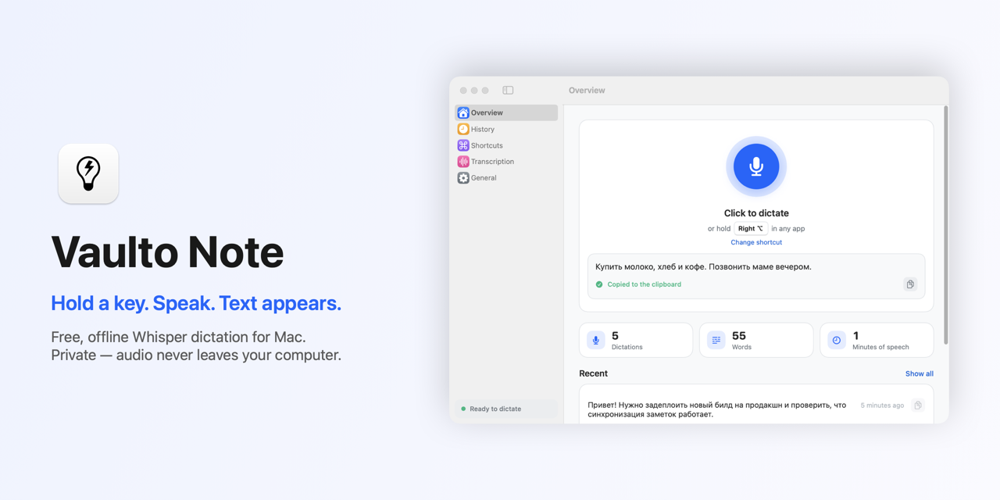
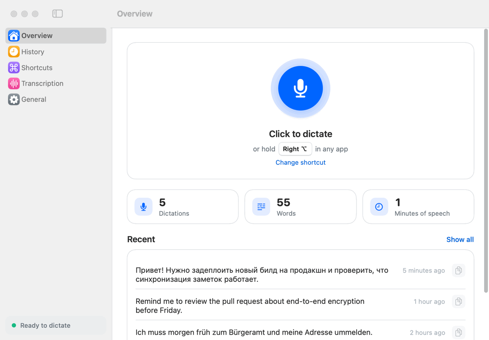
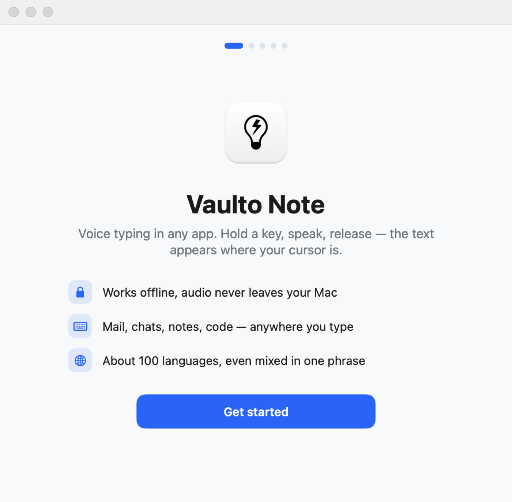
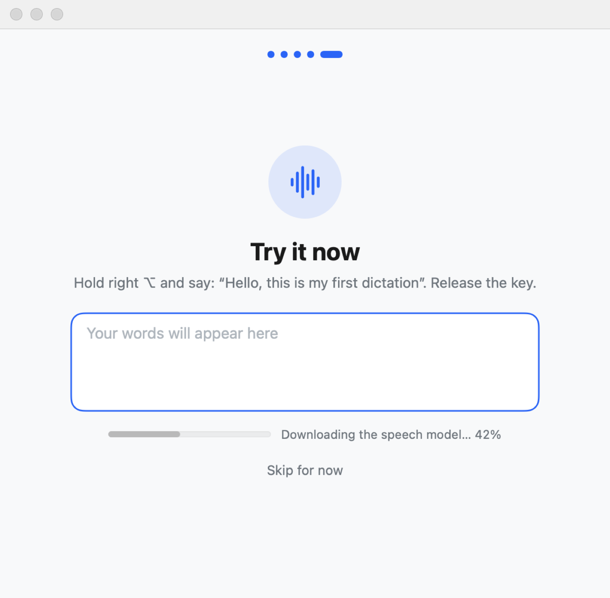
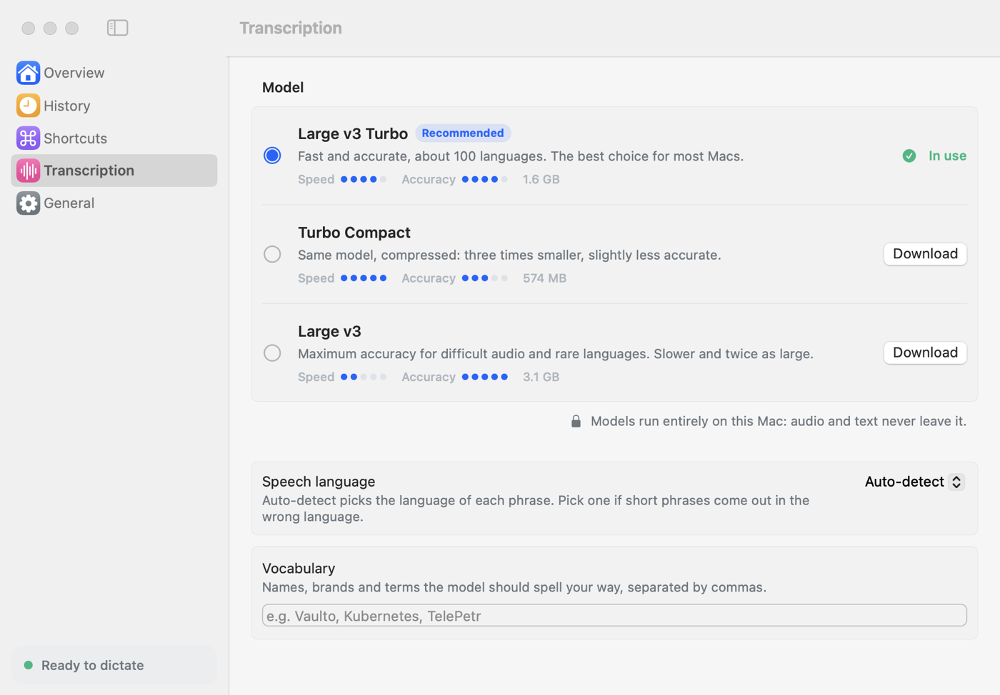
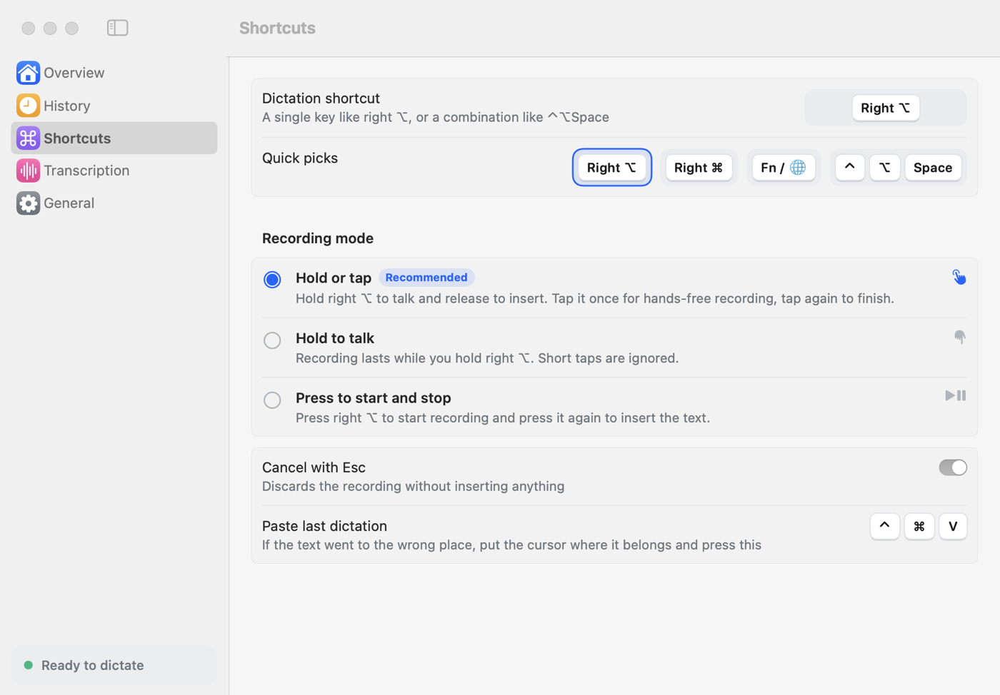
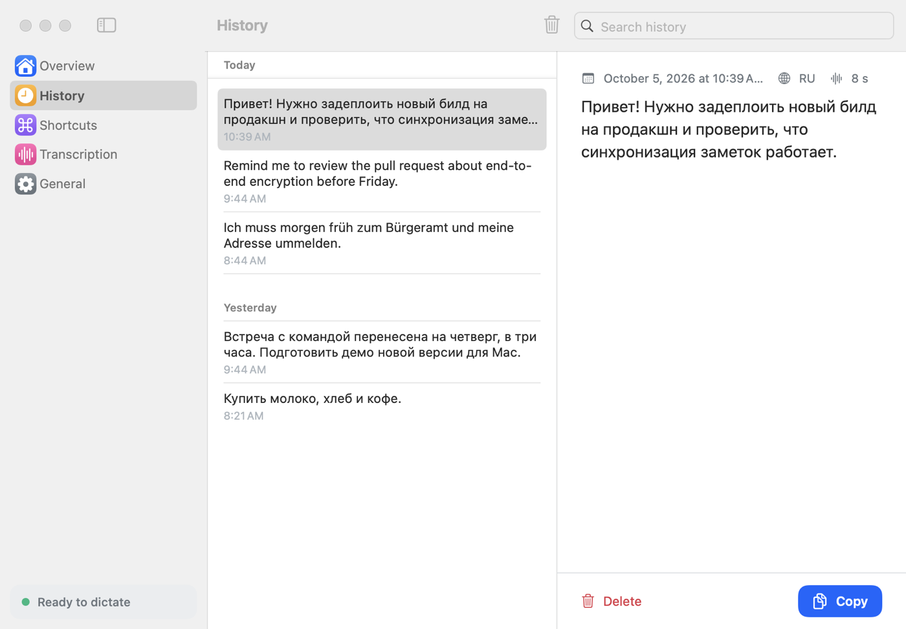
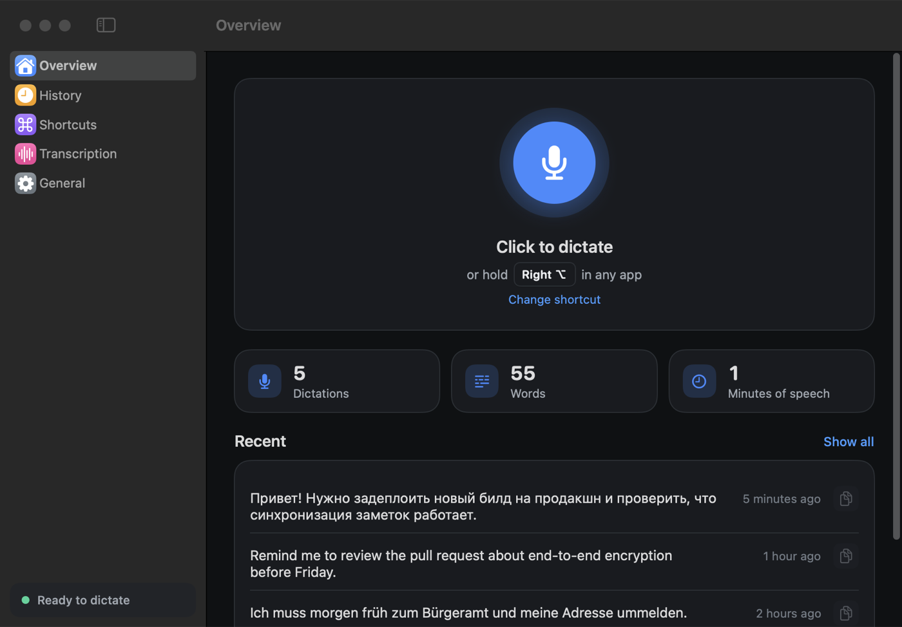

<p align="center">
  
</p>

<h1 align="center">Vaulto Note for Mac</h1>

<p align="center">
  <b>Hold a key, speak, release — your words appear in any app.</b><br>
  Free, open-source voice typing for macOS powered by OpenAI Whisper.<br>
  Runs 100% on your Mac: no cloud, no account, no subscription.
</p>

<p align="center">
  <a href="https://github.com/dirusanov/vaulto-note-mac/releases/latest"></a>
</p>

<p align="center">
  
  
  
  
  
  
</p>

<p align="center">
  
</p>

---

## Why Vaulto Note

- **Private by design.** Speech recognition runs locally with [whisper.cpp](https://github.com/ggml-org/whisper.cpp) on the GPU. Audio and text never leave your Mac — it works in airplane mode.
- **Types where you work.** Mail, Slack, Telegram, Notes, VS Code, the browser — the text lands wherever your cursor is.
- **Fast.** An 8-second phrase is transcribed in about 0.6 s on Apple Silicon with Whisper Large v3 Turbo.
- **Multilingual.** About 100 languages with automatic detection, even when you mix languages in one sentence ("задеплоить новый build").
- **Free and open source.** MIT-licensed. No account, no limits, no telemetry.

<p align="center">
  
</p>

## Features

| | |
|---|---|
| 🎙 **Push-to-talk anywhere** | Hold right ⌥ (or any key you like), speak, release. |
| 👆 **Hold or tap** | Hold to talk, or tap once for hands-free recording and tap again to finish. Toggle-only and hold-only modes too. |
| ⌨️ **Any shortcut** | A single key (right ⌥ / ⌘ / ⇧ / ⌃, Fn 🌐) or a combo like ⌃⌥Space. Esc cancels. |
| 🖱 **One-click recording** | A big mic button in the app for quick voice notes — the text is copied for you. |
| 🧠 **Choice of models** | Whisper Large v3 Turbo (recommended), a compact 574 MB version, or Large v3 for maximum accuracy. Download, switch and delete in one click. |
| 📖 **Custom vocabulary** | Teach it names, brands and jargon so they're spelled your way. |
| 🛟 **Never lose a dictation** | No text field focused? The text stays on the clipboard. ⌃⌘V pastes your last dictation again. |
| 🕘 **Searchable history** | Every dictation, grouped by day, with search and one-click copy. |
| 📋 **Clipboard-friendly** | Your previous clipboard is restored after pasting. |
| 🌍 **8 interface languages** | English, Русский, Deutsch, Español, Français, Português, 中文, 日本語 — follows your system language. |
| 🌓 **Native macOS feel** | SwiftUI, light & dark mode, menu bar icon, open at login, optional Dock icon. |

## Screenshots

<table>
  <tr>
    <td></td>
    <td></td>
  </tr>
  <tr>
    <td align="center"><sub>Five-step welcome: permissions are explained before they're asked</sub></td>
    <td align="center"><sub>Your first dictation happens right inside the setup</sub></td>
  </tr>
  <tr>
    <td></td>
    <td></td>
  </tr>
  <tr>
    <td align="center"><sub>Pick a Whisper model — speed and accuracy at a glance</sub></td>
    <td align="center"><sub>Record any shortcut, choose how it behaves</sub></td>
  </tr>
  <tr>
    <td></td>
    <td></td>
  </tr>
  <tr>
    <td align="center"><sub>History: search, group by day, copy</sub></td>
    <td align="center"><sub>Dark mode</sub></td>
  </tr>
</table>

## Install

1. Download **Vaulto-Note-x.y.z.dmg** from the [latest release](https://github.com/dirusanov/vaulto-note-mac/releases/latest).
2. Open it and drag **Vaulto Note** onto **Applications**.
3. **First launch:** the app isn't notarized by Apple yet, so macOS will warn you once.
   macOS 14: right-click the app → **Open** → **Open**.
   macOS 15+: try to open it, then **System Settings → Privacy & Security → Open Anyway**.
   Or in Terminal: `xattr -dr com.apple.quarantine "/Applications/Vaulto Note.app"`
4. Follow the welcome screens: allow the microphone and Accessibility, pick your key, try your first dictation.

The speech model (about 1.6 GB) downloads once during setup; after that everything works offline.

**Requirements:** macOS 14 Sonoma or later, Apple Silicon (M1 or newer), ~2 GB of free space.

## How it works

```
 hold key ─▶ AVAudioEngine (16 kHz mono) ─▶ whisper.cpp on Metal ─▶ cleanup ─▶ ⌘V into the focused app
```

- **Microphone** is on only while you record; macOS shows its orange indicator.
- **Accessibility** lets the app notice your shortcut in other apps and paste with ⌘V. It doesn't read your screen or keystrokes beyond the shortcut.
- The only network request is downloading the model from [Hugging Face](https://huggingface.co/ggerganov/whisper.cpp).
- History is a local JSON file in `~/Library/Application Support/VaultoNote/`.

## Models

| Model | Size | Best for |
|---|---|---|
| **Large v3 Turbo** | 1.6 GB | Recommended: fast and accurate in ~100 languages |
| Turbo Compact (q5) | 574 MB | Same model, a third of the size, slightly less accurate |
| Large v3 | 3.1 GB | Hard audio and rare languages, slower |

## FAQ

<details>
<summary><b>Is it really free? What's the catch?</b></summary>

It's MIT-licensed open source. There's no server, so there's nothing to charge for. Vaulto Note for Mac is the desktop companion of the <a href="https://play.google.com/store/search?q=Vaulto%20Note&c=apps">Vaulto Note</a> mobile app.
</details>

<details>
<summary><b>Does it work offline?</b></summary>

Yes. After the one-time model download, recognition is fully local.
</details>

<details>
<summary><b>How is it different from Apple's built-in dictation?</b></summary>

Whisper handles punctuation, technical terms and mixed-language speech much better, works the same in every app, lets you choose the model and add your own vocabulary, and keeps a searchable history.
</details>

<details>
<summary><b>Is this an alternative to Superwhisper, Wispr Flow or MacWhisper?</b></summary>

If you want push-to-talk Whisper dictation that's free, open source and fully offline — yes. Those apps have more features (AI rewriting, cloud models, file transcription); Vaulto Note focuses on fast, private dictation.
</details>

<details>
<summary><b>The Fn / 🌐 key opens emoji instead of recording.</b></summary>

System Settings → Keyboard → "Press 🌐 key to" → Do Nothing. Or use right ⌥, which works out of the box.
</details>

<details>
<summary><b>Intel Macs?</b></summary>

Not supported: Whisper Large needs Apple Silicon's GPU to be fast enough for dictation.
</details>

## Build from source

```bash
git clone https://github.com/dirusanov/vaulto-note-mac.git
cd vaulto-note-mac
scripts/create-dev-cert.sh        # once: stable signing identity, keeps permissions across rebuilds
scripts/build-app.sh --install    # builds and copies to ~/Applications
scripts/package-release.sh        # release .dmg (drag-to-Applications window) and .zip
```

Needs Xcode (used via `DEVELOPER_DIR`). The prebuilt whisper.cpp XCFramework is downloaded on first build.

```bash
DEVELOPER_DIR=/Applications/Xcode.app/Contents/Developer swift test   # 25 tests incl. end-to-end transcription
"build/Vaulto Note.app/Contents/MacOS/VaultoNote" --snapshot /tmp/snap en ru de   # render every screen to PNG
"build/Vaulto Note.app/Contents/MacOS/VaultoNote" --transcribe speech.wav ru       # headless transcription
```

<details>
<summary>Code layout</summary>

- `AppController` — app state and the dictation pipeline; the UI binds to it
- `WhisperEngine` — whisper.cpp wrapper, serialized on one queue
- `AudioRecorder` — AVAudioEngine → 16 kHz mono Float32
- `Hotkeys` — shortcut model, hold/tap/toggle state machine, `flagsChanged` + Carbon hot keys
- `TextInserter` — focused-field check, clipboard + synthetic ⌘V, clipboard restore
- `MainWindow`, `Onboarding`, `HUD`, `Components`, `Theme` — SwiftUI interface
- `Localization` — interface strings in 8 languages
- `Snapshot` — renders screens, GIF frames and the banner for docs
</details>

## Roadmap

- [ ] Notarized builds and Homebrew cask
- [ ] Sync dictations with the Vaulto Note mobile app (end-to-end encrypted)
- [ ] Optional AI cleanup of filler words
- [ ] Pause media while recording

Ideas and bug reports are welcome in [Issues](https://github.com/dirusanov/vaulto-note-mac/issues). If Vaulto Note saves you typing, a ⭐ helps others find it.

## Русский

**Vaulto Note для Mac** — бесплатный голосовой ввод на базе Whisper, который работает полностью на вашем Mac. Удерживайте правый ⌥, говорите, отпустите — текст появится там, где стоит курсор, в любом приложении. Около 100 языков с автоопределением (можно смешивать русский и английский в одной фразе), без интернета, без аккаунта и подписки. Скачайте `.dmg` в [релизах](https://github.com/dirusanov/vaulto-note-mac/releases/latest) и перетащите приложение в «Программы»; при первом запуске нажмите на нём правой кнопкой → «Открыть» (на macOS 15+ — Системные настройки → Конфиденциальность и безопасность → «Всё равно открыть»).

## Credits

- [whisper.cpp](https://github.com/ggml-org/whisper.cpp) by Georgi Gerganov and contributors
- [OpenAI Whisper](https://github.com/openai/whisper) models

## License

[MIT](LICENSE) © 2026 Dmitrii Rus

<sub>Keywords: whisper dictation mac, speech to text macOS, offline voice typing, local transcription, push to talk dictation, voice to text app, whisper.cpp app, Apple Silicon, privacy, open source dictation, Superwhisper alternative, Wispr Flow alternative, MacWhisper alternative.</sub>
